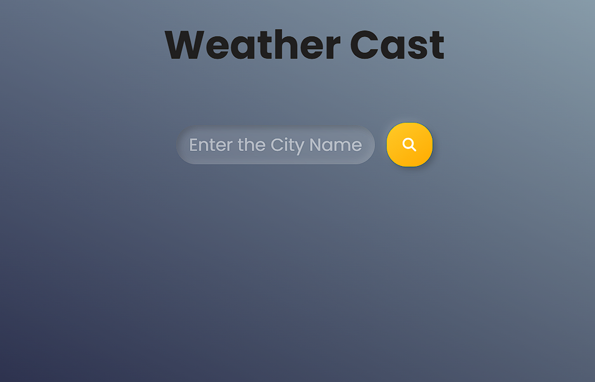

# 🌤️ Weather App

A modern, responsive weather application that provides real-time weather information and forecasts for cities worldwide. Built with vanilla JavaScript, HTML5, and CSS3, featuring a clean user interface and seamless user experience.

## ✨ Features

### Core Functionality
- 🌡️ **Real-Time Weather Data** - Get current weather conditions for any city
- 📅 **Weather Forecast** - View detailed weather predictions
- 🔍 **City Search** - Search for weather information by city name
- 📍 **Location Detection** - Automatic weather updates based on your location
- 🌍 **Global Coverage** - Weather data for cities worldwide

### User Experience
- 📱 **Responsive Design** - Works perfectly on desktop, tablet, and mobile
- 🎨 **Modern UI** - Clean and intuitive interface with smooth animations
- ⚡ **Fast Performance** - Quick loading and real-time updates
- 🌓 **Dynamic Backgrounds** - Weather-appropriate visual themes

## 🚀 Live Demo

[🌐 View Live Demo](https://weather-app-alpha-five-34.vercel.app/)

## 📸 Screenshots

### Desktop View

## 🛠️ Technologies Used

- **Frontend:**
  - HTML5 - Semantic markup and structure
  - CSS3 - Modern styling with Flexbox/Grid
  - JavaScript (ES6+) - Interactive functionality and API integration

- **API Integration:**
  - OpenWeatherMap API - Weather data source
  - Geolocation API - Location detection

- **Development Tools:**
  - Git & GitHub - Version control
  - VS Code - Development environment
  - GitHub Pages - Deployment

## 📋 Weather Information Displayed

### Current Weather
- 🌡️ Temperature (°C/°F)
- 🌤️ Weather conditions and description
- 💨 Wind speed and direction
- 💧 Humidity percentage
- 👁️ Visibility distance
- 🌡️ Feels like temperature
- 📊 Atmospheric pressure
